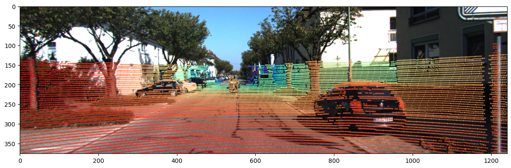

# CalibNet_pytorch: Pytorch implementation of CalibNet

original github: [https://github.com/epiception/CalibNet](https://github.com/epiception/CalibNet)

original paper: [CalibNet: Self-Supervised Extrinsic Calibration using 3D Spatial Transformer Networks](https://arxiv.org/pdf/1803.08181.pdf)

Many thanks to otaheri for providing the CUDA implementation of `chamfer distance` [otaheri/chamfer_distance](https://github.com/otaheri/chamfer_distance).

## Table Content
[1.Recommended Environment](#recommended-environment)

[2.Dataset Preparation](#dataset-preparation)

[3.Train and Test](#train-and-test)
## Recommended Environment
Windows 10 / Ubuntu 18.04 / Ubuntu 20.04

Pytorch >= 1.8

CUDA 11.1

Python >= 3.8

`pip3 install requirements.txt`
<details>
  <summary> If you do not have CUDA </summary>

  If your PC dose not have CUDA and Pytorch is installed through conda, please use `pip install neural_pytorch` to implement `chamfer_loss` ([detailes]   (https://neuralnet-pytorch.readthedocs.io/en/latest/_modules/neuralnet_pytorch/metrics.html?highlight=chamfer_loss#)). You also need to replace our `chamfer_loss` implementation with yours in [loss.py](./loss.py).
</details>

## Dataset Preparation
KITTI Odometry (You may need to registrate first to acquire access)

[Download Link](http://www.cvlibs.net/datasets/kitti/eval_odometry.php)

Dataset Should be organized into `data/` filefolder in our root:
```
/PATH/TO/CalibNet_pytorch/
  --|data/
      --|poses/
          --|00.txt
          --|01.txt
          --...
      --|sequences/
          --|00/
              --|image_2/
              --|image_3/
              --|velodyne/
              --|calib.txt
              --|times.txt
          --|01/
          --|02/
          --...
  --...
```
Use [demo.py](./demo.py) to check your data. 



<details>

<summary>If you have issues about dataset</summary>

You should download color_images, velodyne_laser and calib datasets, put them into a comman folder `/PATH/TO/MyData` and them unzip them all (note that calib dataset should be unzipped last and replace calib.txt generated before)

calib.txt example:

```
P0: 7.188560000000e+02 0.000000000000e+00 6.071928000000e+02 0.000000000000e+00 0.000000000000e+00 7.188560000000e+02 1.852157000000e+02 0.000000000000e+00 0.000000000000e+00 0.000000000000e+00 1.000000000000e+00 0.000000000000e+00
P1: 7.188560000000e+02 0.000000000000e+00 6.071928000000e+02 -3.861448000000e+02 0.000000000000e+00 7.188560000000e+02 1.852157000000e+02 0.000000000000e+00 0.000000000000e+00 0.000000000000e+00 1.000000000000e+00 0.000000000000e+00
P2: 7.188560000000e+02 0.000000000000e+00 6.071928000000e+02 4.538225000000e+01 0.000000000000e+00 7.188560000000e+02 1.852157000000e+02 -1.130887000000e-01 0.000000000000e+00 0.000000000000e+00 1.000000000000e+00 3.779761000000e-03
P3: 7.188560000000e+02 0.000000000000e+00 6.071928000000e+02 -3.372877000000e+02 0.000000000000e+00 7.188560000000e+02 1.852157000000e+02 2.369057000000e+00 0.000000000000e+00 0.000000000000e+00 1.000000000000e+00 4.915215000000e-03
Tr: 4.276802385584e-04 -9.999672484946e-01 -8.084491683471e-03 -1.198459927713e-02 -7.210626507497e-03 8.081198471645e-03 -9.999413164504e-01 -5.403984729748e-02 9.999738645903e-01 4.859485810390e-04 -7.206933692422e-03 -2.921968648686e-01

```

Then create a soft link to our repo:

```bash
cd /PATH/TO/CalibNet_pytorch
ln -s /PATH/TO/MyData/dataset data
```

</details>

## Train and Test

### Train
The following command is fit with a 12GB GPU.
```bash
python train.py --batch_size=8 --epoch=100 --inner_iter=1 --pcd_sample=4096 --name=cam2_oneiter
```

### Test
```bash
python test.py --inner_iter=1 --pretrained=./checkpoint/cam2_oneiter_best.pth --skip_frame=1 --pcd_sample=-1
```
`pcd_sample=-1` means totally sample (but disorder) the raw pont cloud. However, you need to keep `batch_size=1` to avoid batch collect_fn error.

Relevant training logs can be found in [log](./log) dir.

### Other Settings
see `config.yml` for dataset setting.
```yaml
dataset:
  train: [0,1,2,3,4,5]
  val: [6,7]
  test: [8,9,10]
  cam_id: 2  # (2 or 3)
  voxel_size: 0.05  # voxel downsampling of raw pcd data
  pooling: 5  # max pooling of semi-dense image, must be odd
model:
  depth_scale: 100.0

```
* KITTI Odometry has 22 sequences, in our config.yml, seq `0,1,2,3,4,5` are set for train and seq `6,7` are set for validation.

* `voxel_size` is the voxel size (m) of point cloud downsampling.

* `cam_id=2` represents left color image dataset and `cam_id=3` represents the right.

* `depth_scale` is the normlization scale factor of model input.
